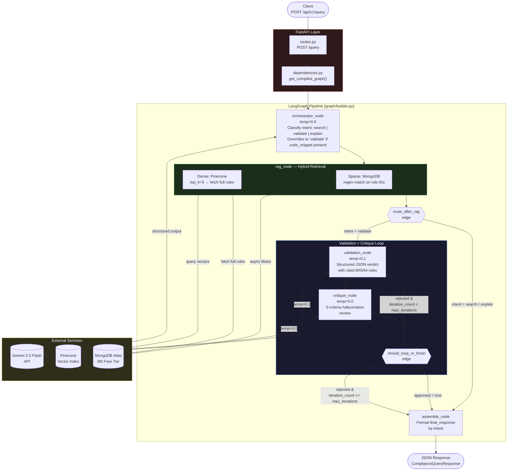

# MISRA C:2023 Compliance Validator

A production-quality **multi-agent system** that parses MISRA C:2023 technical standards and validates C code against them. Built as a GitHub portfolio project demonstrating LLM orchestration, RAG pipelines, and agentic critique loops.

---

## Tech Stack

| Layer | Technology |
|---|---|
| API | FastAPI + Uvicorn |
| LLM | Google Gemini 2.5 Flash (`langchain-google-genai`) |
| Embeddings | `gemini-embedding-001` (768 dims) |
| Vector DB | Pinecone (free tier, serverless, cosine) |
| Document DB | MongoDB Atlas M0 (free) via Motor (async) |
| Agent framework | LangGraph + LangChain Core |
| Config | Pydantic Settings + `python-dotenv` |
| Language | Python 3.11+ |

---

## Architecture



---

## Project Structure

```
MyProjectCv/
├── main.py                         # FastAPI app factory
├── requirements.txt
├── pytest.ini
│
├── app/
│   ├── config.py                   # Pydantic Settings (lru_cache)
│   ├── utils.py                    # parse_json_response() + structlog logger
│   ├── models_pricing.py           # Gemini model pricing table
│   │
│   ├── models/
│   │   ├── state.py                # ComplianceState TypedDict
│   │   ├── requests.py             # ComplianceQueryRequest, IngestRuleRequest
│   │   └── responses.py            # ComplianceQueryResponse, HealthResponse
│   │
│   ├── graph/
│   │   ├── builder.py              # StateGraph wiring + assemble_node
│   │   ├── edges.py                # route_after_rag, should_loop_or_finish
│   │   └── nodes/
│   │       ├── orchestrator.py     # Intent classifier
│   │       ├── rag.py              # Hybrid retrieval
│   │       ├── validation.py       # MISRA compliance checker
│   │       └── critique.py         # Hallucination reviewer
│   │
│   ├── services/
│   │   ├── llm_service.py          # Gemini LLM wrapper
│   │   ├── embedding_service.py    # gemini-embedding-001 (768 dims)
│   │   ├── pinecone_service.py     # Auto-creates index, query, upsert
│   │   └── mongodb_service.py      # Async Motor CRUD + indexes
│   │
│   ├── api/
│   │   ├── routes.py               # GET /health, POST /query, POST /seed
│   │   └── dependencies.py         # Graph + DB deps (lru_cache)
│   │
│   └── data/
│       └── ingest.py               # MISRA ingestion → MongoDB + Pinecone
│
├── data/
│   └── misra_c_2023__headlines_for_cppcheck.txt
│
└── tests/
    └── unit/
        └── graph/nodes/
            └── test_rag.py
```

---

## API Endpoints

| Method | Path | Description |
|---|---|---|
| `GET` | `/api/v1/health` | Pings MongoDB and Pinecone; returns `healthy` or `degraded` |
| `POST` | `/api/v1/query` | Runs the full LangGraph multi-agent pipeline |
| `POST` | `/api/v1/seed` | Parses MISRA txt file and ingests into MongoDB + Pinecone |

### Example Query Request

```json
{
  "query": "Does this code handle memory allocation safely?",
  "code_snippet": "char *p = malloc(n);",
  "standard": "MISRA C:2023"
}
```

### Example Query Response

```json
{
  "query": "Does this code handle memory allocation safely?",
  "intent": "validate",
  "standard": "MISRA C:2023",
  "is_compliant": false,
  "confidence_score": 0.92,
  "validation_result": "The code violates MISRA C Rule 21.3...",
  "cited_rules": ["MISRA_21.3"],
  "final_response": "...",
  "iteration_count": 1
}
```

---

## Setup

### 1. Clone and install

```bash
git clone https://github.com/<your-username>/MyProjectCv.git
cd MyProjectCv
pip install -r requirements.txt
```

### 2. Configure environment

```bash
cp .env.example .env
```

Edit `.env` with your credentials:

```env
# Required
GEMINI_API_KEY=your_key_here
PINECONE_API_KEY=your_key_here
MONGODB_URI=mongodb+srv://...

# Optional (defaults shown)
GEMINI_MODEL=gemini-2.5-flash
GEMINI_EMBEDDING_MODEL=gemini-embedding-001
PINECONE_INDEX_NAME=compliance-rules
PINECONE_CLOUD=aws
PINECONE_REGION=us-east-1
MONGODB_DATABASE=compliance_db
MONGODB_COLLECTION=rules
```

### 3. Start the server

```bash
uvicorn main:app --reload
```

### 4. Seed the knowledge base (run once)

```bash
curl -X POST http://localhost:8000/api/v1/seed
```

### 5. Health check

```bash
curl http://localhost:8000/api/v1/health
```

Swagger UI is available at `http://localhost:8000/docs`.

---

## Agent Pipeline Detail

### Orchestrator Node (`temp=0.0`)
Classifies the user's intent as `search`, `validate`, or `explain`. If a `code_snippet` is present in the request, intent is always overridden to `validate`. Outputs a structured `OrchestratorOutput` Pydantic object and hardcodes `standard="MISRA C:2023"`.

### RAG Node — Hybrid Retrieval
Combines two retrieval strategies:
- **Sparse (MongoDB):** regex match against rule IDs found in the query text
- **Dense (Pinecone):** semantic vector search `top_k=5`, filtered by `{"scope": "MISRA C:2023"}`, then full rule text is fetched from MongoDB using the vector IDs

### Validation Node (`temp=0.1`)
Checks C code against the retrieved MISRA rules. Returns a structured JSON verdict with `is_compliant`, `confidence_score`, and `cited_rules`. Handles `critique_feedback` from the critique node on re-runs.

### Critique Node (`temp=0.0`)
Reviews the validation output against 5 hallucination criteria. Returns `critique_approved` (bool) and `critique_feedback`. If rejected and `iteration_count < max_iterations` (default: 4), the graph loops back to the validation node.

### Assemble Node
Formats `final_response` based on the resolved intent. Defined inline in `graph/builder.py`.

---

## Running Tests

```bash
pytest tests/ -v --cov
```

---

## License

[Apache 2.0](LICENSE)
