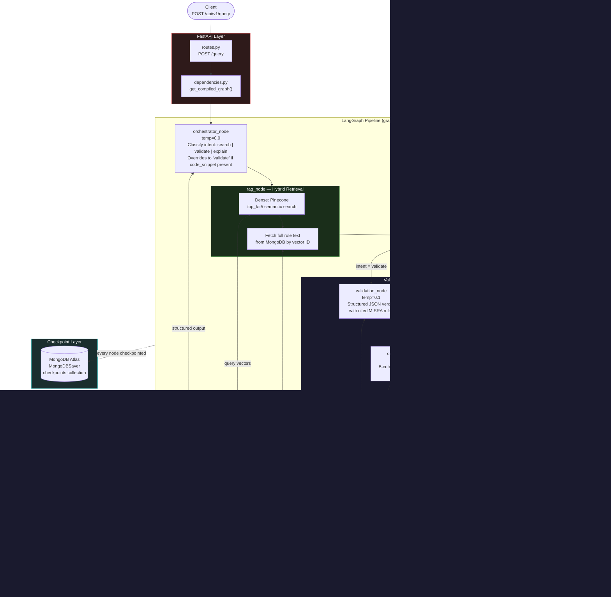

# MISRA C:2023 Compliance Validator

A production-quality **multi-agent system** that parses MISRA C:2023 technical standards, validates C code against them, and proposes remediated fixes. Built as a GitHub portfolio project demonstrating LLM orchestration, RAG pipelines, agentic critique loops, automated code remediation, **Multi-expert architecture** with intent-based routing, and **async-first architecture with persistent state checkpointing**.

---

## Highlights

- **Fully asynchronous** end-to-end: every graph node, service call, and route handler is `async`. Even the synchronous Pinecone SDK is wrapped with `asyncio.to_thread()` to never block the event loop.
- **Multi-expert architecture** — the Orchestrator acts as a gating network, dynamically dispatching each request to the appropriate specialist agent (RAG, Validator, Critique, Remedier) based on classified intent, activating only the relevant experts per input.
- **MongoDB checkpoint memory** — every node execution is durably persisted to MongoDB Atlas via LangGraph's `MongoDBSaver`, enabling session resumption, time-travel replay, and horizontal scaling without a local SQLite file.
- **Granular Session Resumption** — clients can pass a `thread_id` to continue a previous session, or omit it to start fresh. Every response returns the `thread_id` for future reference.
- **"Time Travel" debugging** via the `/replay` endpoint — fork and re-execute from any checkpoint in a session's history, essential for verifying complex MISRA C compliance logic where multiple agents (Orchestrator, RAG, Validator, Critique) interact across iterations.
- **Per-request cost estimation** — every LLM-calling node tracks `prompt_tokens` and `completion_tokens` using LangGraph's `Annotated[int, operator.add]` state reducers, automatically accumulating totals across all agents. Each response includes an `estimated_cost` (USD) computed from a built-in pricing table covering 30+ Gemini models (`app/models_pricing.py`), giving full cost visibility without any external billing API.
- **Configurable timeouts** — every external call (LLM, Pinecone, MongoDB) is wrapped in `asyncio.wait_for()` with individual configurable timeouts, ensuring graceful degradation instead of hanging requests.

---

## Tech Stack

| Layer | Technology |
|---|---|
| API | FastAPI + Uvicorn |
| LLM | Google Gemini 2.5 Flash (`langchain-google-genai`) |
| Embeddings | `gemini-embedding-001` (768 dims) |
| Vector DB | Pinecone (free tier, serverless, cosine) |
| Document DB | MongoDB Atlas M0 (free) via Motor (async) |
| Checkpoint DB | MongoDB Atlas M0 via `MongoDBSaver` (sync pymongo — see note below) |
| Agent framework | LangGraph + LangChain Core |
| Config | Pydantic Settings + `python-dotenv` |
| Logging | `structlog` (structured, console renderer) |
| Language | Python 3.11+ |

---

## Architecture



---

## Graph State Machine: Node & Edge Map

The LangGraph pipeline is a `StateGraph[ComplianceState]` with 6 nodes and 2 conditional edge functions:

| Node | Role | Temp | Structured Output |
|---|---|---|---|
| `orchestrator_node` | Intent classification (`search` / `validate` / `explain`) | 0.0 | `OrchestratorOutput` |
| `rag_node` | Dense vector search (Pinecone) + full rule fetch (MongoDB) | — | `retrieved_rules`, metadata |
| `validation_node` | MISRA C compliance audit with cited rules | 0.1 | `ValidationOutput` |
| `critique_node` | 5-criteria hallucination review | 0.0 | `CritiqueOutput` |
| `remedier_node` | Minimally-modified MISRA-compliant code generation | 0.2 | `RemediationOutput` |
| `assemble_node` | Formats `final_response` string by intent (no I/O) | — | — |

| Edge function | Condition | Routes to |
|---|---|---|
| `route_after_rag` | intent == "validate" | `validation_node` |
| `route_after_rag` | intent == "search" or "explain" | `assemble_node` |
| `should_loop_or_finish` | approved + compliant | `assemble_node` |
| `should_loop_or_finish` | approved + not compliant | `remedier_node` |
| `should_loop_or_finish` | rejected + iter < max | `validation_node` (self-correction loop) |
| `should_loop_or_finish` | rejected + iter >= max | `assemble_node` (fallback) |

The **`ComplianceState`** TypedDict threads data across all nodes. Token and cost counters use `Annotated[int, operator.add]` and `Annotated[float, operator.add]` so LangGraph accumulates them automatically via state reducers. `critique_history` uses `Annotated[list[CritiqueEntry], operator.add]` to append entries across iterations.

---

## Project Structure

```
LangGragh-Agent-IA-for-Misra-C/
├── main.py                              # FastAPI app factory + lifespan (MongoDB checkpoint)
├── requirements.txt
├── pytest.ini
│
├── app/
│   ├── config.py                        # Pydantic Settings (lru_cache), CORS origins, timeout config
│   ├── utils.py                         # parse_json_response(), calculate_gemini_cost(), structlog
│   ├── models_pricing.py                # Gemini model pricing table (30+ models)
│   │
│   ├── models/
│   │   ├── state.py                     # ComplianceState TypedDict (with token tracking reducers)
│   │   ├── requests.py                  # ComplianceQueryRequest (with thread_id), max_length validation
│   │   └── responses.py                 # ComplianceQueryResponse, ThreadHistory*, MetadataUsage
│   │
│   ├── graph/
│   │   ├── builder.py                   # build_graph() with MongoDBSaver + inline assemble_node
│   │   ├── edges.py                     # route_after_rag, should_loop_or_finish
│   │   └── nodes/
│   │       ├── orchestrator.py          # Intent classifier (async, structured output)
│   │       ├── rag.py                   # Dense retrieval: Pinecone → MongoDB (async)
│   │       ├── validation.py            # MISRA compliance checker (async, structured output)
│   │       ├── critique.py              # 5-criteria hallucination reviewer (async, structured output)
│   │       └── remedier.py              # Code remediation (async, structured output)
│   │
│   ├── services/
│   │   ├── llm_service.py              # get_llm(), get_structured_llm() wrappers
│   │   ├── embedding_service.py         # Singleton, async embed + store
│   │   ├── pinecone_service.py          # Auto-creates index, query/upsert via asyncio.to_thread
│   │   └── mongodb_service.py           # Async Motor CRUD (rules) + sync pymongo (checkpoints)
│   │
│   ├── api/
│   │   ├── routes.py                    # (legacy entry-point, delegates to v1)
│   │   ├── dependencies.py             # get_compiled_graph (from app.state), DB deps, rate limiter
│   │   └── v1/
│   │       ├── routes.py                # /health, /query, /seed, /replay, /history
│   │       ├── requests.py              # ComplianceQueryRequest (v1 schema)
│   │       └── responses.py             # ComplianceQueryResponse, HealthResponse, etc. (v1 schema)
│   │
│   ├── auth/
│   │   ├── models.py                    # UserCreate, Principal, TokenResponse, APIKeyResponse, etc.
│   │   ├── service.py                   # bcrypt, JWT (HS256), API key generation/verification
│   │   ├── dependencies.py             # get_current_principal — dual JWT/API-key resolver
│   │   └── router.py                    # /auth/register, /token, /refresh, /api-keys CRUD
│   │
│   └── data/
│       └── ingest.py                    # MISRA parser → MongoDB + Pinecone ingestion
│
├── data/
│   └── misra_c_2023__headlines_for_cppcheck.txt   # ~250+ raw MISRA C:2023 rule definitions
│
└── tests/
    ├── conftest.py                      # Session-wide settings override with dummy keys
    ├── misra_test_sample.c              # ADCS CubeSat controller with deliberate MISRA violations
    ├── code_c_snippet_example.json      # 10 pre-built test payloads
    └── unit/
        ├── graph/
        │   ├── test_builder.py
        │   ├── test_edges.py
        │   └── nodes/
        │       ├── test_rag.py
        │       ├── test_orchestrator.py
        │       ├── test_validation.py
        │       ├── test_critique.py
        │       └── test_remedier.py
        ├── services/
        │   └── test_mongodb_service.py
        └── utils/
            └── test_utils.py
```

---

## API Endpoints

| Method | Path | Auth Required | Description |
|---|---|---|---|
| `GET` | `/api/v1/health` | No | Pings MongoDB and Pinecone; returns `healthy` or `degraded` |
| `POST` | `/api/v1/query` | Yes (`query:read`) | Runs the full LangGraph multi-agent pipeline |
| `POST` | `/api/v1/seed` | Yes (`admin:seed`) | Parses MISRA txt file and ingests into MongoDB + Pinecone |
| `POST` | `/api/v1/replay/{thread_id}/{checkpoint_id}` | Yes (`admin:replay`) | Re-executes the graph from a specific checkpoint (Time Travel) |
| `GET` | `/api/v1/history/{thread_id}` | Yes (`query:read`) | Returns all checkpoint snapshots for a session |
| `POST` | `/api/v1/auth/register` | No | Create a user account (optionally with admin scopes) |
| `POST` | `/api/v1/auth/token` | No | OAuth2 password flow — returns access + refresh token pair |
| `POST` | `/api/v1/auth/refresh` | No | Rotate a refresh token — revoke old, issue new pair |
| `POST` | `/api/v1/auth/api-keys` | Yes | Generate a new API key scoped to caller's permissions |
| `GET` | `/api/v1/auth/api-keys` | Yes | List all active API keys for the authenticated user |
| `DELETE` | `/api/v1/auth/api-keys/{key_id}` | Yes | Revoke (soft-delete) an API key |

Swagger UI is available at `http://localhost:8000/docs` (root `/` redirects there). The "Authorize" button in Swagger posts to `/api/v1/auth/token` automatically.

### Example: Validate a code snippet

```json
{
  "query": "Does this code handle memory allocation safely?",
  "code_snippet": "char *p = malloc(n);",
  "standard": "MISRA C:2023"
}
```

### Example: Resume a previous session

```json
{
  "query": "What about the pointer arithmetic in line 12?",
  "thread_id": "abc123-previous-session-id",
  "standard": "MISRA C:2023"
}
```

Pass a `thread_id` from a previous response to continue the same session. Omit it to start a new session (a UUID is auto-generated).

### Example: Ask a question (no code snippet)

```json
{
  "query": "What does MISRA C:2023 say about pointer arithmetic?",
  "standard": "MISRA C:2023"
}
```

When no `code_snippet` is provided, the orchestrator classifies the intent as `search` or `explain` and returns relevant rules directly — skipping validation, critique, and remediation entirely.

### Example Query Response (non-compliant code)

```json
{
  "thread_id": "13b4b917-2198-430b-96e4-95b8f17d1b3c",
  "intent": "validate",
  "final_response": "Validation Complete.\nStandard: MISRA-C\nCompliant: False\nConfidence: 100%\nCited rules: Rule MISRA_RULE_1.3\nDetails: Rule MISRA_RULE_1.3 (Required): The return value of 'malloc' on line 10 is not checked. If 'malloc' fails and returns a NULL pointer, any subsequent attempt to dereference this pointer would result in undefined behavior. In a safety-critical flight controller, unhandled memory allocation failures can lead to system crashes, unpredictable behavior, or a failure to enter a safe state, which is extremely dangerous. Fix: Always check the return value of 'malloc' and handle potential allocation failures gracefully, for example, by setting a system fault code or entering a safe operational mode. For instance: 'void* ptr = malloc(100); if (ptr == NULL) { system_fault_code = 1; /* Handle error */ }'.\nRule MISRA_RULE_1.3 (Required): The memory allocated by 'malloc' on line 10 is never freed. This constitutes a memory leak. In a long-running embedded system like a flight controller, repeated memory leaks can exhaust the available memory, leading to system instability, unexpected behavior, or a complete system failure. This is a critical unspecified behavior. Fix: Ensure that dynamically allocated memory is freed when it is no longer required. If 'ptr' is a temporary resource, it should be freed within the function or its scope. If it's a persistent resource, its lifecycle must be explicitly managed, including a corresponding 'free' call during system shutdown or when the resource is no longer needed. For instance: 'void* ptr = malloc(100); if (ptr != NULL) { /* Use ptr */ free(ptr); ptr = NULL; }'.",
  "is_compliant": false,
  "confidence_score": 1.0,
  "cited_rules": [
    "Rule MISRA_RULE_1.3"
  ],
  "critique_iterations": 1,
  "critique_passed": true,
  "critique_history": [
    {
      "iteration": 1,
      "issues_found": [],
      "approved": true
    }
  ],
  "retrieved_rule_ids": [
    "MISRA_RULE_1.5",
    "MISRA_RULE_1.3",
    "MISRA_RULE_14.3",
    "MISRA_RULE_2.1",
    "MISRA_RULE_17.4"
  ],
  "error": null,
  "fixed_code_snippet": "/* flight_controller.c */\n#include <stdio.h>\n#include <stdlib.h>\n#include <stdint.h>\n\n#define MAX_ALTITUDE 45000\n\nint system_fault_code = 0;\n\nvoid System_Init() {\n    void* ptr = malloc(100);\n    if (ptr == NULL) {\n        system_fault_code = 1;\n    } else {\n        free(ptr);\n        ptr = NULL;\n    }\n}\n\nint main(void) {\n    System_Init();\n    return 0;\n}",
  "remediation_explanation": "MISRA_RULE_1.3 (Required): The return value of 'malloc' on line 10 was not checked, potentially leading to undefined behavior if allocation failed. Additionally, the memory allocated by 'malloc' was never freed, causing a memory leak → An 'if (ptr == NULL)' check was added after the 'malloc' call on line 10. If 'malloc' fails, 'system_fault_code' is set to 1 to indicate an error. If 'malloc' succeeds, 'free(ptr)' is called immediately, and 'ptr' is set to 'NULL' to release the allocated memory and prevent a memory leak, as the memory was not used further within the function. This ensures proper error handling and memory management.",
  "total_tokens_usage": {
    "prompt_tokens": 3008,
    "completion_tokens": 5327,
    "total_tokens": 8335,
    "orchestrator_tokens": 594,
    "validation_tokens": 2738,
    "critique_tokens": 2236,
    "remediation_tokens": 2767,
    "estimated_cost": 0.0142199
  }
}
```

---

## Authentication

All inference and admin endpoints are protected by a dual-token auth system. The same `Authorization: Bearer <token>` header accepts both JWTs and API keys — the resolver detects which is being used by the `ak_` prefix.

### Auth methods

| Method | Format | Use case |
|---|---|---|
| JWT access token | Standard Bearer JWT (HS256) | Interactive clients, Swagger UI |
| API key | `ak_<key_id>_<secret>` | Headless scripts, CI pipelines, integrations |

### Scope catalogue

| Scope | Grants access to |
|---|---|
| `query:read` | `POST /query`, `GET /history`, API key management |
| `admin:seed` | `POST /seed` |
| `admin:replay` | `POST /replay` |
| `admin:all` | Wildcard — satisfies any scope check |

### Quick start

```bash
# 1. Register (standard account — query:read scope)
curl -X POST http://localhost:8000/api/v1/auth/register \
  -H "Content-Type: application/json" \
  -d '{"email": "you@example.com", "password": "s3cure!pw"}'

# 1b. Register with full admin scopes (requires ADMIN_REGISTRATION_TOKEN set in .env)
curl -X POST http://localhost:8000/api/v1/auth/register \
  -H "Content-Type: application/json" \
  -d '{"email": "admin@example.com", "password": "s3cure!pw", "admin_token": "<ADMIN_REGISTRATION_TOKEN>"}'

# 2. Get tokens (OAuth2 password flow — use email as username)
curl -X POST http://localhost:8000/api/v1/auth/token \
  -d 'username=you@example.com&password=s3cure!pw'
# → {"access_token": "eyJ...", "refresh_token": "eyJ...", "expires_in": 1800}

# 3. Call a protected endpoint
curl -X POST http://localhost:8000/api/v1/query \
  -H "Authorization: Bearer eyJ..." \
  -H "Content-Type: application/json" \
  -d '{"query": "Is malloc safe here?", "code_snippet": "char *p = malloc(n);"}'

# 4. Generate an API key (scopes capped to your own account's scopes)
curl -X POST http://localhost:8000/api/v1/auth/api-keys \
  -H "Authorization: Bearer eyJ..." \
  -H "Content-Type: application/json" \
  -d '{"name": "ci-pipeline", "scopes": ["query:read"]}'
# → {"key_id": "...", "full_key": "ak_...", ...}  ← shown once, store securely

# 5. Use the API key directly (no login flow needed)
curl -X POST http://localhost:8000/api/v1/query \
  -H "Authorization: Bearer ak_..." \
  -H "Content-Type: application/json" \
  -d '{"query": "Check this code", "code_snippet": "int x = 0/0;"}'
```

### Security properties

- **Passwords** — bcrypt with SHA-256 pre-hash (avoids bcrypt's 72-byte truncation)
- **API key secrets** — bcrypt-hashed at creation; the `full_key` is shown once and never stored
- **API key lookup** — `ak_<key_id>` prefix enables O(1) DB lookup before the expensive bcrypt verify
- **Refresh token rotation** — each `/refresh` call revokes the old token atomically; a stolen token can only be used once
- **Anti-privilege escalation** — API keys cannot be created with scopes the issuing account does not hold
- **JWT fields** — `sub` (user_id), `email`, `scopes`, `exp`, `type: "access"|"refresh"`

---

## MongoDB Checkpoint Memory

Every node execution in the LangGraph pipeline is automatically persisted to MongoDB Atlas via LangGraph's `MongoDBSaver`. This provides:

- **Durable state** — the full `ComplianceState` (query, retrieved rules, validation results, critique feedback, token counts) is saved after each node completes.
- **Session continuity** — clients resume conversations by re-using a `thread_id`. The graph picks up exactly where it left off.
- **Crash recovery** — if the server restarts mid-pipeline, the checkpoint allows resumption from the last completed node rather than re-running from scratch.
- **Horizontal scaling** — unlike a local SQLite file, MongoDB Atlas is accessible from multiple server instances, enabling stateless, scalable deployments.

The MongoDB connection is managed via FastAPI's `lifespan` context manager in `main.py`: opened on startup, passed into `build_graph()`, and closed cleanly on shutdown.

### Important note on `AsyncMongoDBSaver` and the `MongoDBSaver`

`AsyncMongoDBSaver` is no longer in the `langgraph` package — it has migrated to `langchain-mongodb`. However, according to the official repo README, the recommended approach for async is now to use `MongoDBSaver` directly with its async methods (`aput`, `aget`, `alist`).

The context manager remains **synchronous** (`with`, not `async with`), but all async methods `aput`, `aget`, `alist`, as well as `graph.astream()` / `graph.ainvoke()` work perfectly in the **async** context inside.

```python
# Correct pattern — sync context manager, async methods inside
with MongoDBSaver.from_conn_string(settings.mongodb_uri) as checkpointer:
    graph = build_graph(checkpointer)
    # async methods work normally inside async route handlers:
    result = await graph.ainvoke(state, config)
```

This means the checkpoint layer in `main.py` uses a **sync pymongo** client for `MongoDBSaver`, while rule storage uses the separate **async Motor** client (`MongoDBService`). Both are created during the FastAPI `lifespan` startup and stored on `app.state`.

---

## Granular Session Resumption

The API supports **granular session resumption** through `thread_id` tracking:

1. **Start a session** — `POST /query` without a `thread_id`. The server generates a UUID and returns it in the response.
2. **Continue a session** — `POST /query` with the same `thread_id`. LangGraph loads the checkpointed state and continues from where it left off.
3. **Inspect a session** — `GET /history/{thread_id}` returns the full checkpoint timeline: every node that executed, the state at each point, and the `checkpoint_id` for each snapshot.

---

## Time Travel Debugging with `/replay`

The `POST /replay/{thread_id}/{checkpoint_id}` endpoint enables **"Time Travel" debugging** — the ability to fork from any past checkpoint and re-execute the graph from that point forward.

This is essential for verifying complex MISRA C compliance logic where multiple agents (Orchestrator, RAG, Validator, Critique) interact across iterations:

- **Reproduce critique loops** — replay from a specific validation checkpoint to observe how the Critique agent evaluates the same evidence a second time.
- **Debug non-determinism** — re-run from the same state to see if the Validator produces consistent verdicts across executions.
- **Inspect branching decisions** — fork from just before `route_after_rag` or `should_loop_or_finish` to verify routing logic with the actual intermediate state.
- **Audit compliance verdicts** — given the safety-critical nature of MISRA C, Time Travel lets you replay the exact sequence of agent decisions that led to a compliance / non-compliance ruling.

### Workflow

```bash
# 1. Run a query
curl -X POST http://localhost:8000/api/v1/query \
  -H "Content-Type: application/json" \
  -d '{"query": "Is this safe?", "code_snippet": "char *p = malloc(n);"}'
# → returns thread_id: "abc123"

# 2. Inspect the checkpoint timeline
curl http://localhost:8000/api/v1/history/abc123
# → returns ordered list of checkpoints with IDs

# 3. Replay from a specific checkpoint
curl -X POST http://localhost:8000/api/v1/replay/abc123/checkpoint_xyz
# → re-executes from that point, returns fresh ComplianceQueryResponse
```

---

## Async Architecture

The entire pipeline is asynchronous:

| Component | Pattern |
|---|---|
| Route handlers | `async def` with `await graph.ainvoke()` |
| Graph nodes (orchestrator, rag, validation, critique, remedier) | `async def` with `await asyncio.wait_for(llm.ainvoke(...), timeout=...)` |
| MongoDB rules service | `motor.AsyncIOMotorClient` (native async) |
| Pinecone service | Sync SDK wrapped in `asyncio.to_thread()` + `asyncio.wait_for()` |
| Embedding service | `aembed_query()` / `aembed_documents()` |
| MongoDB checkpoint | `MongoDBSaver` (sync pymongo) — sync context manager, async methods |
| Assemble node | `async def`, pure string formatting (no I/O, no `await`) |

### Timeout Configuration

Every external call has its own configurable timeout enforced with `asyncio.wait_for()`. On timeout, each node returns a graceful degraded state rather than raising an exception that would crash the graph.

| Setting | Default | Applies to |
|---|---|---|
| `LLM_TIMEOUT` | 30s | All four LLM-calling nodes |
| `PINECONE_TIMEOUT` | 15s | Vector query in `rag_node` |
| `MONGODB_TIMEOUT` | 15s | Rule fetch in `rag_node` |

---

## Agent Pipeline Detail

### Orchestrator Node (`temp=0.0`)
Classifies the user's intent as `search`, `validate`, or `explain`. If a `code_snippet` is present in the request, intent is always overridden to `validate`. Outputs a structured `OrchestratorOutput` Pydantic object and hardcodes `standard="MISRA C:2023"`.

### RAG Node — Vector Retrieval

Performs three sequential async operations per request:

1. **Embed** — queries `GoogleGenerativeAIEmbeddings.aembed_query()` to produce a 768-dim vector.
2. **Pinecone search** — `top_k=5` cosine similarity search filtered by `{"scope": "MISRA C:2023"}` to prevent cross-standard contamination.
3. **MongoDB fetch** — decomposes Pinecone vector IDs (format: `MISRA_RULE_15.1` or `MISRA_DIR_4.1`) back into `$or` queries using a regex, then fetches full rule documents from the `compliance_db.rules` collection.

Results are sorted by `relevance_score` descending before being written to state. If Pinecone returns no matches, MongoDB is not called.

### Validation Node (`temp=0.1`)
Checks C code against the retrieved MISRA rules. Returns a structured JSON verdict with `is_compliant`, `confidence_score`, and `cited_rules`. Handles `critique_feedback` from the critique node on re-runs.

### Critique Node (`temp=0.0`)
Reviews the validation output against 5 explicit hallucination criteria:

| # | Criterion | Description |
|---|---|---|
| 1 | Rule Hallucination | Cited rules must exist in the actually-retrieved set |
| 2 | Logical Consistency | `is_compliant` verdict must match the textual explanation |
| 3 | Code Grounding | Explanation must reference specific code constructs |
| 4 | Standard Accuracy | Rule IDs must follow `MISRA_RULE_X.Y` format and include the category label |
| 5 | Completeness | All actual violations in the code must be addressed |

Returns `critique_approved` (bool) and `critique_feedback`. If rejected and `iteration_count < max_iterations` (default: 4), the graph loops back to validation.

### Remediation Node (`temp=0.2`)
Triggered only when `critique_approved=True` and `is_compliant=False`. Takes the original non-compliant code, the cited rules (with full rule text), and the validation report, then generates a minimally-modified compliant version. Respects MISRA rule categories (Mandatory / Required / Advisory) and outputs both `fixed_code_snippet` and a per-rule `remediation_explanation`.

### Assemble Node
Formats `final_response` based on the resolved intent. Defined as `async def assemble_node` inline in `graph/builder.py`. No LLM call — pure string formatting.

---

## Token Tracking and Cost Estimation

Every LLM-calling node tracks `prompt_tokens`, `completion_tokens`, and `total_tokens` via `usage_metadata` from the raw `AIMessage` returned by `include_raw=True` structured output calls. These counters use `Annotated[int, operator.add]` in `ComplianceState`, so they accumulate automatically across nodes via LangGraph's state reducer without any explicit merging logic.

The response includes a `total_tokens_usage` object with per-node breakdowns (`orchestrator_tokens`, `validation_tokens`, `critique_tokens`, `remediation_tokens`) and an `estimated_cost` computed from Gemini's pricing table (`app/models_pricing.py`). The pricing table is injected dynamically at startup via `@model_validator(mode="after")` in `config.py` based on the configured `GEMINI_MODEL`.

---
[](https://github.com/raydje/langgraph-agent-ia-for-misra-c/actions/workflows/ci.yml)
---
## Setup

### 1. Clone and install

```bash
git clone https://github.com/<your-username>/LangGragh-Agent-IA-for-Misra-C.git
cd LangGragh-Agent-IA-for-Misra-C
pip install -r requirements.txt
```

### 2. Configure environment

```bash
cp .env.example .env
```

Edit `.env` with your credentials:

```env
# Required
GEMINI_API_KEY=your_key_here
PINECONE_API_KEY=your_key_here
MONGODB_URI=mongodb+srv://...

# Optional (defaults shown)
GEMINI_MODEL=gemini-2.5-flash
GEMINI_EMBEDDING_MODEL=gemini-embedding-001
EMBEDDING_DIMENSIONS=768
PINECONE_INDEX_NAME=compliance-rules
PINECONE_CLOUD=aws
PINECONE_REGION=us-east-1
MONGODB_DATABASE=compliance_db
MONGODB_COLLECTION=rules
MONGODB_CHECKPOINTS_COLLECTION=checkpoints

# Timeouts (seconds)
LLM_TIMEOUT=30
PINECONE_TIMEOUT=15
MONGODB_TIMEOUT=15

# Agent behavior
MAX_CRITIQUE_ITERATIONS=4
CONFIDENCE_THRESHOLD=0.85
MAX_INPUT_LENGTH=3000

# Per-node temperatures
ORCHESTRATOR_TEMPERATURE=0.0
VALIDATION_TEMPERATURE=0.1
CRITIQUE_TEMPERATURE=0.0
REMEDIATION_TEMPERATURE=0.2

# CORS
CORS_ALLOWED_ORIGINS=["http://localhost:3000","http://localhost:8501","http://localhost:8080"]

# Auth (JWT + API keys)
JWT_SECRET_KEY=changeme-in-production
JWT_ACCESS_TOKEN_EXPIRE_MINUTES=30
JWT_REFRESH_TOKEN_EXPIRE_DAYS=7
ADMIN_REGISTRATION_TOKEN=           # empty = admin self-registration disabled
```

### 3. Start the server

```bash
uvicorn main:app --reload
```

### 4. Seed the knowledge base (run once)

```bash
curl -X POST http://localhost:8000/api/v1/seed
```

This parses `data/misra_c_2023__headlines_for_cppcheck.txt`, upserts all rules into `compliance_db.rules` (MongoDB), generates 768-dim embeddings, and uploads them to the Pinecone index. Re-running is safe — MongoDB upserts are idempotent via `ReplaceOne` with `upsert=True`.

### 5. Health check

```bash
curl http://localhost:8000/api/v1/health
```

Swagger UI is available at `http://localhost:8000/docs`.

---

## Running Tests

```bash
pytest tests/ -v --cov
```

Tests mock all external services (Gemini, Pinecone, MongoDB) via `conftest.py` and `pytest-mock`. No API keys are needed to run the test suite.

The `conftest.py` autouse session-fixture patches `get_settings()` globally and clears the `lru_cache` before and after the session. Node tests mock `get_structured_llm` to return a fake chain with an `AsyncMock` that returns the `{"raw": ..., "parsed": ..., "parsing_error": ...}` dict structure expected by `include_raw=True`. Edge tests are pure synchronous unit tests with no dependencies.

---

## License

[Apache 2.0](LICENSE)